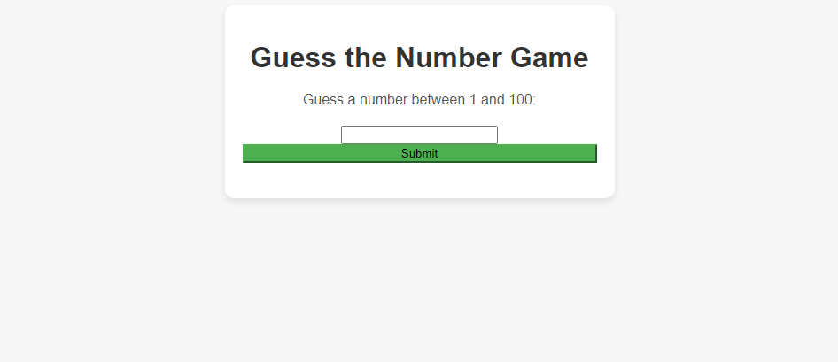

# Guess-the-number

  

A simple guessing game made in html, css and javascript, where you put a random number from 0 to 100 to try to guess which number was generated. // Um joguinho simples de adivinhação feito em html, css e javascript, onde você coloca um número aleatório de 0 a 100 para tentar acertar qual número foi gerado.

 ## 🔨 Functionalities // Funcionalidades
 
- `Functionalities`: Spend time trying to get the exact number right // Passar o tempo tentando acertar o número exato.

## 🛠️ How to use // Como usar

- `Acess link // Acesse o link`: https://guess-the-number-murex.vercel.app

- `Enter a number from 1 to 100 // Coloque um número de 1 a 100` : Click submit and the code itself will tell you if it's close or not. // Clique em submit e o próprio código dirá se está perto ou não.

 # Developer
 [ Thales Eduardo Pedro](https://github.com/thales32k0)
 
